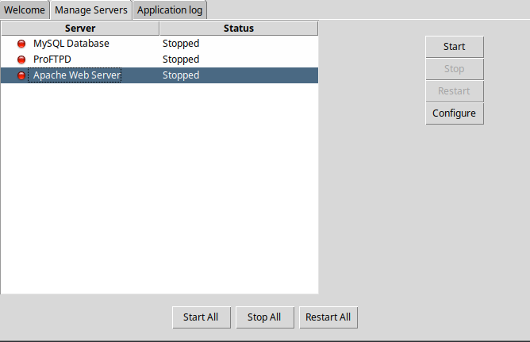

# Meus projetos PHP da Faculdade! #

## Se quiser testar cada um desses sites é simples, basta realizar os seguintes comandos ##

### Para rodar o(s) projeto(s) siga esses passos:

### baixe o Xampp ou Lampp

[Xampp/Lampp](https://www.apachefriends.org/pt_br/download.html)

~~~Para clonar o repositório:
git clone https://github.com/vitaooo/EletivaI-1-2025.git
~~~

~~~Entrar no diretório que quer rodar o sistema
ex: cd sistema_campeonato
~~~

~~~Rodar o projeto PHP
php -S localhost:8080
~~~

##Abrir o Xampp e rodar o mysql e o apache web server:

